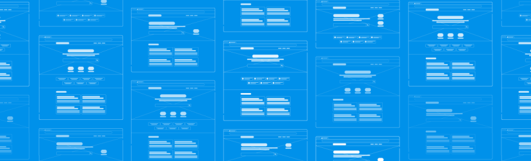
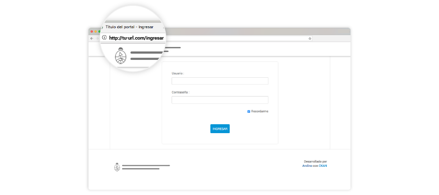
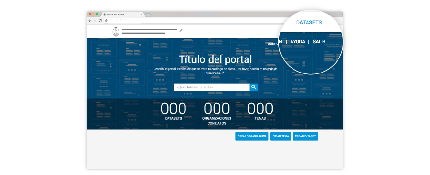
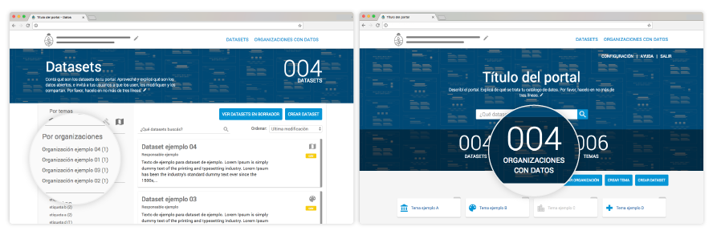
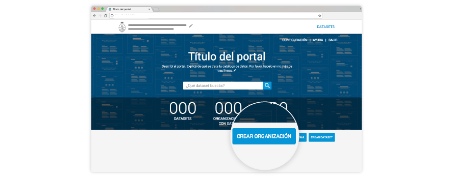
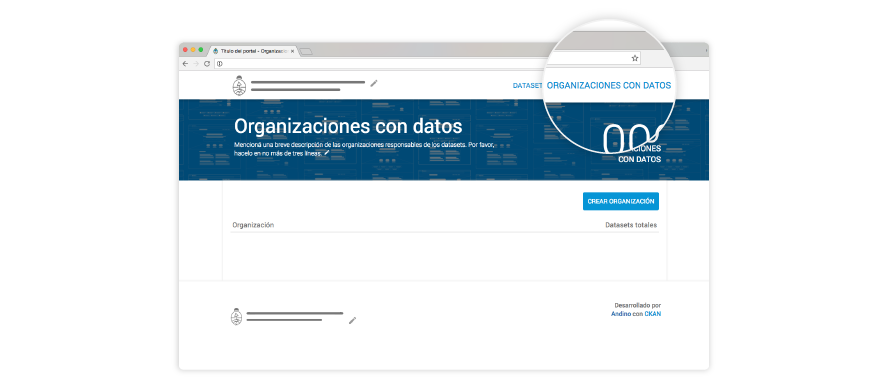
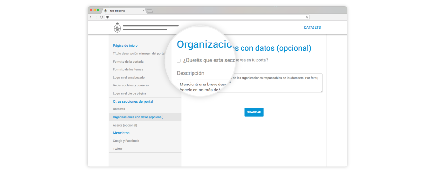
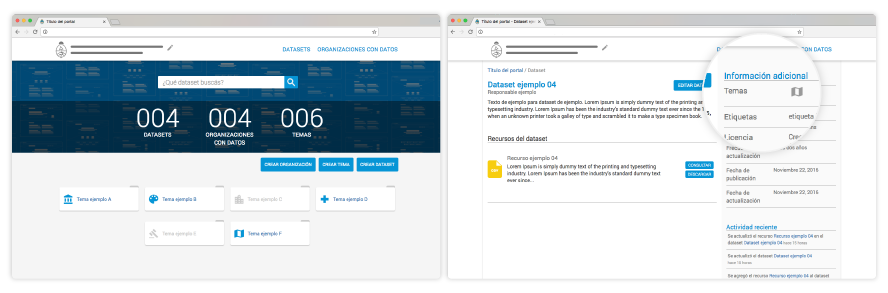
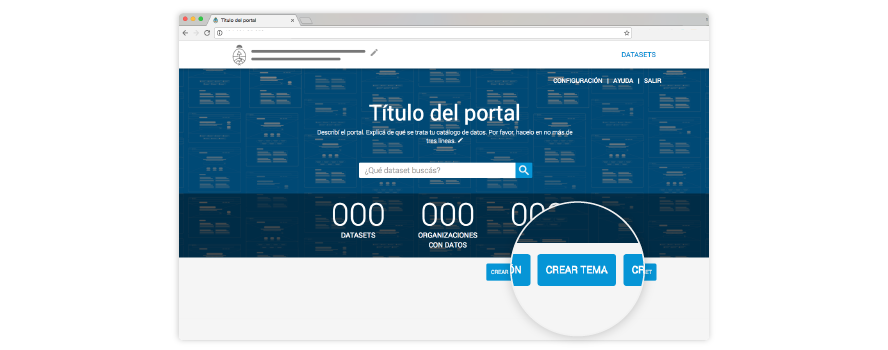

# Guía de uso Portal Andino

<!-- START doctoc generated TOC please keep comment here to allow auto update -->
<!-- DON'T EDIT THIS SECTION, INSTEAD RE-RUN doctoc TO UPDATE -->

- [Primeros pasos](#primeros-pasos)
- [Entrar y salir de tu portal](#entrar-y-salir-de-tu-portal)
- [Elementos de tu portal](#elementos-de-tu-portal)
  - [Organizaciones](#organizaciones)
  - [Sección Organizaciones con datos](#secci%C3%B3n-organizaciones-con-datos)
  - [Temas](#temas)
  - [Datasets](#datasets)
  - [Recursos](#recursos)
  - [Etiquetas](#etiquetas)
- [Personalizar el portal](#personalizar-el-portal)
- [Otros contenidos útiles](#otros-contenidos-%C3%BAtiles)

<!-- END doctoc generated TOC please keep comment here to allow auto update -->

## Primeros pasos

**¡Un aplauso, ya estás abriendo tus datos!**

Esta guía te ayudará a:

* Conocer los elementos del catálogo e identificar dónde se ven en el portal.
* Personalizar el portal.
* Crear datasets, recursos, organizaciones y temas.

¡Arranquemos!

## Entrar y salir de tu portal

Para poder entrar y salir de tu portal, **es necesario que tu administrador haya creado un usuario y contraseña**. Con esa información, cada vez que quieras entrar al portal, **podrás hacerlo desde http://*tu-url.com*/ingresar**.

**Para salir**, sólo tenés que **hacer clic en el botón en el margen superior derecho**.

**¿Y si olvidé mi contraseña?**

Por el momento, tanto la creación del usuario y la contraseña, como la recuperación de esta última sólo podrá hacerla quien se haya encargado de instalarte Andino. 

## Elementos de tu portal

### Organizaciones 

Son los organismos que abren o mantienen cada dataset. **Es muy importante que crees las organizaciones antes de que generes un dataset** que esté asociado a ella. 

##### ¿Dónde lo veo en el portal?

* Como uno de los filtros de la vista de Datasets. 

* Como número agregado, en la Página principal de tu portal, en caso de que hayas elegido la vista que muestra el número de Organizaciones con datos.

##### Buenas prácticas al crear Organizaciones con datos

Tené en cuenta que **siempre que borres una organización, todos los conjuntos de datos (y también los recursos), se borrarán** definitivamente. 

##### ¿Cómo los creo?

Andá a **Página principal > Crear Organizaciones**.

En caso de que hayas elegido que tu portal tenga una sección de Organizaciones con datos, también se mostrarán allí. 

***
### Sección Organizaciones con datos

**Esta sección es opcional**. Te permite armar un árbol de jerarquías con las organizaciones que abrieron datos en tu portal. Los organismos que se muestran en esta parte de tu portal son los mismos que asignás a los datasets y que creas antes de generar estos últimos. 

##### ¿Dónde lo veo en el portal?

En Página principal > **Organizaciones con datos**.

##### Buenas prácticas al crear la sección Organizaciones con datos

Es importante que tengas bien en claro qué organizaciones dependenden de otras, para que el árbol de jerarquías represente bien las correspondencias. 

##### ¿Cómo las creo?

Como la sección Organizaciones con datos es opcional, podés elegir que se vea en tu portal. Para eso, **andá a Configuraciones > Organizaciones con datos** y tildá la habilitación. 

***
### Temas

Son las categorías en las que se pueden clasificar todos los datasets de tu portal. Hay dos taxonomías de temas:

*  **Temas globales**, que ya vienen con AbreAr, y que necesitás elegir para cada dataset. Estos temas no se ven en tu portal, pero es necesario que lo elijas para que el portal nacional datos.gob.ar pueda republicar el dataset según esta clasificación. Por ejemplo: “Economía y finanzas”. 

* **Temas específicos**, que son opcionales, pero que te recomendamos con énfasis que agregues a todos tus conjuntos de datos porque son los temas que van a ver tus usuarios. Por ejemplo, si el tema global era “Economía y finanzas”, un tema específico podría ser “Compras”. 

##### ¿Dónde lo veo en el portal?

* En la Página principal de tu catálogo de datos. 

* También como detalle de cada dataset específico.

##### Buenas prácticas al crear Temas específicos

* Intentá crear los temas específicos a conciencia para poder reutilizarlos a futuro. 
* No crees un tema específico por cada dataset.
* Asegurate de que cada tema específico sea un aparte más pequeña dentro de los Temas globales. 

##### ¿Cómo los creo?

**Andá a Página principal > Crear tema**. 

##### How do I assign them?

** Each time you generate a new dataset **, the form will prompt you to assign themes. Always remember to reuse the ones you have already created and do not repeat them.

! [Alt text] (assets / portal-andino-form-themes.png "form-themes")
***
### Datasets

We also call them "data sets". They are the main part of your portal or data catalog. Each dataset consists of one or more resources.

##### Where do I see them on the portal?

All datasets that you upload to the portal will be seen ** in the Datasets ** section. In addition, ** you will be able to highlight ** the ones that you create more important in the Main Page.

! [Alt text] (assets / portal-andino-sec-themes-02.png "sec-themes-2")

##### Good Practices When Creating Datasets

* ** Titles of datasets **: this is the first look users will have about their content. So try not to exceed 100 characters. Pay special attention to capital letters. Only their own nouns need them.

* ** Description of datasets **: is the detail that you tell the users. For that reason, it is important that you try to give a general explanation of the data you are going to find. Try not to exceed 500 characters.

##### How do I create them?

Log in to your account and go to ** Home> Create dataset **.

! [Alt text] (assets / portal-andino-create-dataset.png "create-dat")

** You can always edit the dataset ** you have created. To do this, go to your account> Home> Datasets> ** Edit dataset **.
***
### Means

Each dataset consists of at least one resource. That's why we say that resources are the smallest piece of information in the catalog and the real assets of data portal.

##### Where do I see them on the portal?

Home> Datasets> Click the specific resource.

##### Good Practices in Creating Resources
I followed the same writing criteria as the datasets.

* ** Titles **: try not to exceed 150 characters.

* ** Description of resources **: try not to exceed 200 characters.

##### How do I create them?

Log in to your account and go to Home> Create dataset. Once you complete the dataset, you can add resources.

! [Alt text] (assets / portal-andino-asig-resource.png "create-resource")

As with datasets, you can always edit the resources you have created. To do this, go to your account> Home> Datasets> Edit dataset> Edit features.
***
### Tags

They are the words that help users filter and find datasets. The wider and more uniform the list of labels, the greater its power of help.

##### Where do I see them on the portal?

In each specific dataset.

! [Alt text] (assets / portal-andino-dat-tags.png "dat-tags")

##### Good practices when creating labels

* Use capital letters only where appropriate.
* Identify keywords.
* Respect previous tags.
* Add synonyms and use natural language.
* Try to use a single word, always in the plural.
* If the label has more than one word, separate them by a space. For example: "affidavits".

Here are some useful questions when thinking about tags:

* Which is the topic?
* What aspects will be of interest to users?
* How else would the user find this information?
* What type of information is involved?
* What area does it provide?

##### How do I create them?

As with Themes, each time you generate a new dataset, the form will prompt you to assign a label. Always remember to reuse the ones you have already created and do not repeat them.

! [Alt text] (assets / portal-andino-asig-tags.png "create-tags")

***
### Customize the portal

Making your website represent your organization is very easy. Please ** go to Home> Settings **. You will get to the section that allows you to change how the front cover of your data catalog and each particular section looks.

! [Alt text] (assets / portal-andino-sec-config.png "sec-config")

***
### Other useful contents

* [Guide to using and publishing metadata] (https://github.com/datosgobar/package-apertura-datos/raw/master/docs/Gu%C3%ADa%20para%20el%20uso%20y%20la % 20publication% 20% 20metadatos% 20 (v0.1) .pdf).

* [Guide for the identification and use of interoperable entities] (https://github.com/datosgobar/package-apertura-datos/raw/master/docs/Guia%20para%20la%20identificaci%C3%B3n%20y%20uso % 20% 20% 20interoperable% 20 (v0.1) .pdf).

* [Guide to publishing data in open formats] (https://github.com/datosgobar/package-apertura-datos/raw/master/docs/Gu%C3%ADa%20para%20la%20publicaci%C3%B3n % 20of% 20data% 20in% 20formats% 20authorized% 20 (v0.1) .pdf).